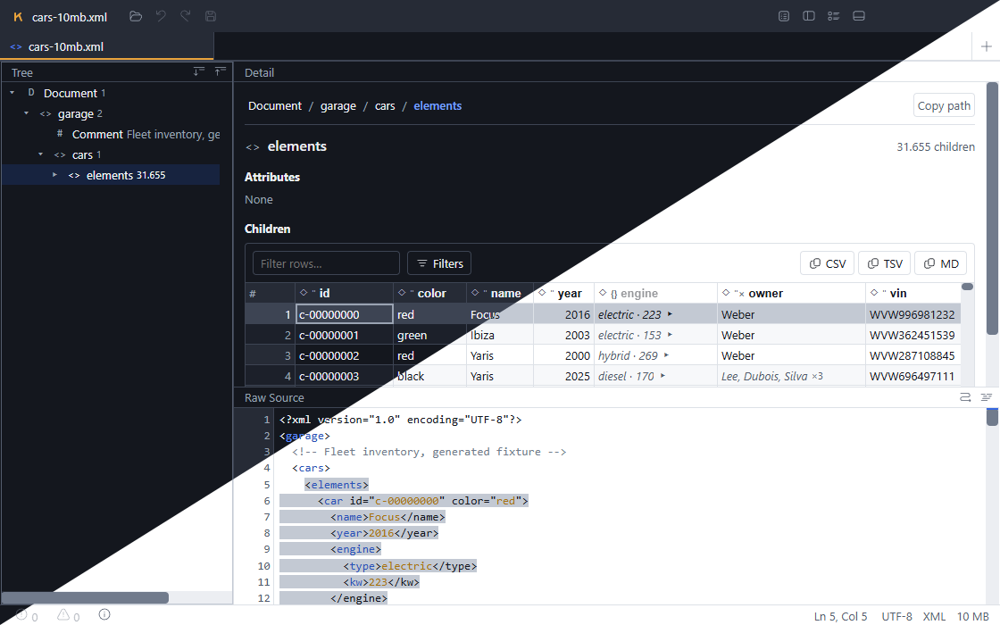

# Klados

**A desktop viewer and source-level editor for hierarchical data files — XML, JSON, TOML and CSV.**

- **Repeating children become a table.** A file with two thousand `<car>` elements turns into a
  grid with one row per car — sortable, filterable, exportable. This is the thing Klados is for.
- **Your file comes back exactly as it went in.** Saving never reformats: comments, key order,
  quoting, indentation and line endings all survive untouched.
- **Edit the real source.** The Raw pane is the file itself, not a rendering of a model.
- **Keyboard-native.** Everything has a shortcut, and `F1` lists them.
- **A command palette at `Ctrl+Shift+P`**, where *every* command in the app can be found.
- **Big files stay usable** — built to stay responsive into the hundreds of megabytes.
- **[Download for Windows, macOS or Linux →](https://github.com/mincowski/klados/releases)**



Most tools of this kind show you a tree, or show you text. Klados shows you both, plus that third
thing: **when a node contains a list of similar children, their contents are collected into a
table** — which is usually what you actually wanted to look at.

Three panes, kept in sync:

- **Tree** — the document's structure
- **Detail** — the selected node's contents as tables; repeating children become a grid you can
  sort, filter, pin columns in, and export
- **Raw** — the source text, exactly as it is on disk

## Download

Builds for Windows, macOS and Linux are on the
[releases page](https://github.com/mincowski/klados/releases).

**The builds are not signed**, so your computer will warn you the first time you open one. This is
normal for small free software, and here is how to get past it:

- **Windows** — a blue "Windows protected your PC" box appears. Click *More info*, then
  *Run anyway*.
- **macOS** — the first launch is refused. Right-click the app and choose *Open*, then confirm.
- **Linux** — make the AppImage executable (`chmod +x`), or install the `.deb` as usual.

Signing certificates cost money and Klados is free, so this is likely to stay true. If that
trade-off doesn't suit you, [building it yourself](#development) takes about two minutes.

### Checking that your download is intact

Every release includes a `SHA256SUMS.txt` file — a fingerprint of each file, written by the build
that produced them. Because the builds are unsigned and there is no auto-updater, the download is
the whole trust decision, so this is how you confirm you got the real thing: it proves your copy is
byte-for-byte what the build made, whatever it travelled through on the way.

This is optional. If you want to do it, download `SHA256SUMS.txt` next to the installer and run one
of these in the same folder:

```bash
# Linux
sha256sum -c SHA256SUMS.txt --ignore-missing
```

```bash
# macOS
shasum -a 256 -c SHA256SUMS.txt --ignore-missing
```

```powershell
# Windows (PowerShell) — compare the printed hash against the matching line in the file
Get-FileHash -Algorithm SHA256 .\klados-1.0.0-setup.exe
```

`--ignore-missing` is what lets you check just the one file you downloaded, instead of needing all
of them.

## What it does today

| Format | Opens |
|---|---|
| **XML** | `.xml`, and any file whose first byte is `<` |
| **JSON** | `.json` |
| **TOML** | `.toml` |
| **CSV** | `.csv`, `.tsv`, `.tab` |

- **Find**, with plain text or a **path query** — `cars//price`, `car[@id="c-001"]`, `car[3]`,
  `car[price>100 and year<2000]`, `car[@id]`, `car[not(@id)]`, `*` for any name. The same syntax
  works across every format, so you only learn it once.
- **Replace**, including replace-all across very large documents.
- **Tabs**, reopened where you left them.
- **Format and minify**, as commands you choose — never automatically.
- **Grid export** — copy a selection as CSV, TSV or Markdown.
- **Light and dark themes**, and zoom.

## Keyboard

**`Ctrl+Shift+P` opens the command palette, and every command in the application can be found
there** — that is enforced by a test rather than by good intentions, so it is safe to rely on.
`F1` opens a list of shortcuts.

The handful worth memorising:

| | |
|---|---|
| `Ctrl+O` | Open a file |
| `Ctrl+F` / `Ctrl+H` | Find / Find with replace |
| `F3` / `Shift+F3` | Next / previous match |
| `Ctrl+1` `Ctrl+2` `Ctrl+3` | Focus the Tree, Detail or Raw pane |
| `Alt+1` … `Alt+9` | Switch tabs |
| `Ctrl+Shift+L` | Toggle light/dark |

## Things it does not do well yet

Listed here so you meet them on this page rather than in the middle of your work. The project keeps
a fuller list in [`docs/TASKS.md`](docs/TASKS.md)'s *Owed* table.

- **XML namespaces stop resolving after you edit a file**, until you close and reopen it. They
  resolve correctly when a file is opened; the faster reparse that runs while you type does not
  carry that information through yet.
- **A namespace-prefixed search** (`//inv:price`) matches the prefix as you typed it rather than
  what it stands for. It tells you "no matches" rather than giving you a wrong answer.
- **A CSV file with no header row keeps only its first unnamed column.** Files with a header row —
  almost all of them — are unaffected.
- **Very wide CSV files are expensive.** Memory depends on how many columns there are rather than
  on file size: ten columns and two million rows (112 MB) needs about 378 MB.
- **Switching to a tab holding a large minified file takes a couple of seconds.**

## How this was built

Klados was written by AI — Claude, working in Claude Code — under human supervision. Every round of
work was planned, reviewed and accepted by a human maintainer, and the design, the decisions and
the priorities are theirs; the great majority of the code, tests and documentation is
machine-authored.

This is disclosed because it is a reasonable thing to want to know before running an editor on your
files. It is not a disclaimer about quality: the architectural rules, the test suite, and a review
pass on every task exist precisely so that supervision means something. Judge it the way you would
judge any other project — by whether it does what it says on files you care about.

If you want to see what that supervision looked like, [`docs/`](docs/README.md) is the working
record: the design, every decision with the alternatives it rejected, and a list of the project's
own unmet acceptance criteria.

## Development

### Prerequisites

- **Node.js 22 LTS or newer** — check with `node --version`
- **npm** (bundled with Node)
- **Git**

Nothing else needs to be installed globally.

### Getting started

```bash
git clone https://github.com/mincowski/klados.git
cd klados
npm install
npm run dev
```

`npm run dev` starts Electron with hot reload for the renderer. Editing files under
`src/renderer/` updates the running app; changes to the main process restart it.

### Commands

| Command | Purpose |
|---|---|
| `npm run dev` | run in development |
| `npm run build` | production build |
| `npm run package` | build a distributable for the current platform |
| `npm test` | the full suite — Node plus a real-Chromium browser project |
| `npm run test:node` / `npm run test:watch` | the Node project only |
| `npm run lint` | eslint, prettier and stylelint |
| `npm run typecheck` | tsc, no emit |
| `npm run inspect -- <file>` | parse a file from the command line and report on it |

`npm run test:large` runs the suite including fixtures over 50 MB. It takes around six minutes and
is not part of CI.

### Project layout

```
src/
  core/        format-agnostic: buffer, node store, interning, row index
  formats/     one module per format (xml, json, toml, csv)
  worker/      parsing off the main thread
  renderer/    the UI
  main/        the Electron main process
test/
docs/          the engineering record — start at docs/README.md
scripts/       build and capture tooling, including the README screenshot
```

The load-bearing boundary is that **nothing above `formats/` knows which format produced a
document.** Format-specific behaviour is expressed through a capabilities record, never by testing
a format id. See `src/core/types.ts` for the contract each format implements.

### Test fixtures

Some tests need large generated files that are deliberately not committed. Rebuild them with:

```bash
npm run fixtures:generate
```

Expect a couple of minutes and about a gigabyte of disk. Tests that need them skip cleanly when
they are absent.

### The screenshot

The image at the top of this file is generated, not hand-made — so it can be refreshed when the UI
changes rather than quietly going out of date:

```bash
npm run build && node scripts/screenshot-panes.mjs
```

It launches the built application, opens a fixture in each theme, and composites the two frames on
the diagonal. It needs `npm run fixtures:generate` to have been run, and a display.

## Contributing

Pull requests are welcome.

**Bug reports are the most useful thing you can send**, especially with a file that reproduces the
problem. If the file cannot be shared, the format plus its approximate size and shape usually get
most of the way there.

**For a small fix** — a typo, a broken link, a clear one-file bug — just open a pull request.

**For anything larger, open an issue first.** Not bureaucracy: this codebase has a few
architectural rules that are load-bearing and not obvious from reading any single file, and a
change that breaks one gets rejected for reasons that look arbitrary unless we have talked first.
The main ones:

- **The document is never converted to a JavaScript string.** JS strings are UTF-16, which doubles
  a 200 MB file. Everything works on `Uint8Array`, decoding short slices on demand.
- **There is no object per node.** Node data lives in parallel typed arrays; all spans are byte
  offsets in `Int32Array`.
- **Parsers are iterative, never recursive**, and never throw on malformed input — they emit a
  diagnostic and carry on, because a partial tree beats an error screen.
- **Editing happens only in the Raw view, and saving writes the byte buffer.** The document is
  never regenerated from the model. This is what makes byte-identical saves possible, and most of
  the rest of the design hangs off it.
- **Nothing above `src/formats/` knows which format produced a document.** Format-specific
  behaviour goes through a capabilities record, never a test against a format id.

`npm test`, `npm run lint` and `npm run typecheck` all need to pass. The test suite runs in Node
and in real Chromium, and takes a couple of minutes.

**You do not need to follow the process in [`CLAUDE.md`](CLAUDE.md).** The `R` numbers, plan
documents and status board described there are the maintainer's own working method — useful to read
if you want to understand why something is the way it is, but not a requirement for a pull request.

## License

MIT. See [`LICENSE`](LICENSE).
